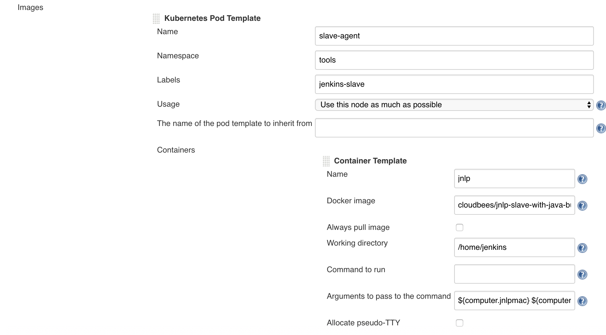

Install Jenkins With Helm Chart
===

## Create Nampspace for tools

* If namespace does not exists, create it

```
kubectl create namespace tools
```

## Create Tools Node Pool 

* If __tools__ node pool does not exist, create it with taint so that normal workload will not run on any node from this node pool.

```
# taint each node in the tools node pool
kubectl taint nodes {{node-name}} tools=true:NoSchedule

# result
  taints:
  - effect: NoSchedule
    key: tools
    value: "true"
```

* This node pool can use preemptive instance to reduce the cost.

* This node pool will be used for running Jenkins build job.

* Terraform's __google_container_node_pool__ resource does not yet support creating node pool with taint. Taint can only be specified when creating cluster using __google_container_cluster__ and all nodes created will have the same taint. 

* Alternatively, use __glcoud__ to create and tain node pool


## Install Jenkins via Helm Chart

* Change values in the __values.yaml__ where ever see fits.
* Execute the command to install Jenkins

```
helm install --name {{release-name}} --set Master.AdminPassword={{admin-password}} .
```

* This will create a __Storage Class__ to dynamically create regional persistent volumes.

* All resources will be created into __tools__ namespace.

## Login to Jenkins

* find out the IP address of Jenkins Master

```
kubectl get service -n tools
```

* port: 8080
* username: __admin__
* password: __{{admin-password}}__


## Post Install Jenkins Configuration

* Go to __Managed Jenkins__ -> __Configure System__ 
* Under __Cloud__ -> __Images__ section, 
    *  Use __tools__ for namespace  

    *  Change docker image. Image has to be JNLP enabled so that container can communicate to Master. Default is __jenkins/jnlp-slave__. For image which contains common Java build tools, use [cloudbees/jnlp-slave-with-java-build-tools](https://github.com/cloudbees/jnlp-slave-with-java-build-tools-dockerfile)

      


    * Under __Container Template__, change resource limit or to whatever necessary

    

    * Under for __Raw yaml for the Pod__, enter the following YAML fragment to add the __tolerations__ and service account to the pod template

        * Service account name should match the __serviceAccountName__ value defined in __values.yaml__
        * Tolerations would allow Jenkins slave pod to run on __tools__ node pool

            ```
            spec:
              serviceAccountName: jenkins
              tolerations:
              - key: tools
                operator: Equal
                value: true
                effect: NoSchedule
            ```
            


		* A Persistent Volume Claim can be be specified for the pod template if needed. PVC name can be retrieved by

			```
			kubectl get pvc -n tools
			``` 


